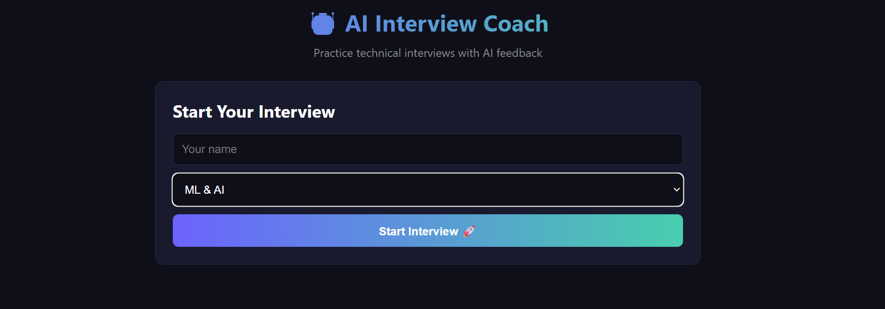

# AI Interview Coach 🤖

## Overview
A real-time AI-powered technical interview preparation application. 
Practice coding interviews with voice interaction, instant feedback, 
and detailed performance reports.

## Features
- 🎤 **Voice Recording** — speak your answers naturally
- 🔊 **AI Voice** — interviewer reads questions aloud
- 📝 **Auto Transcription** — Groq Whisper converts speech to text
- ✏️ **Editable Transcript** — fix transcription errors before submitting
- 🤖 **AI Interviewer** — asks relevant questions per topic
- 📊 **Real-time Evaluation** — score, feedback, and correct answers
- 📈 **Adaptive Difficulty** — harder questions if you perform well
- 🏆 **Final Report** — strengths, weaknesses, hiring recommendation

## Interview Topics
- Python Basics
- Python Advanced
- System Design
- ML & AI
- Data Structures

## Tech Stack

### Backend
- Python
- FastAPI
- Groq API (LLaMA + Whisper)
- LangChain
- python-dotenv

### Frontend
- HTML, CSS, JavaScript
- Web Speech API (voice synthesis)
- MediaRecorder API (voice recording)

## Architecture

User speaks answer
↓
MediaRecorder captures audio
↓
Groq Whisper transcribes speech to text
↓
FastAPI sends to AI Evaluator
↓
Groq LLaMA evaluates and scores answer
↓
AI Interviewer generates next question
↓
Web Speech API reads question aloud
↓
Final report generated after 5 questions

## How To Run

### Install dependencies

pip install fastapi uvicorn groq langchain langchain-groq python-dotenv pydantic

### Setup
Create `backend/.env` file:

GROQ_API_KEY=your_groq_api_key

### Start backend

cd backend
uvicorn main:app --reload

### Open frontend
Open `frontend/index.html` in your browser

## Roadmap
- [ ] User authentication
- [ ] Payment integration ($1/24hr session)
- [ ] More interview topics
- [ ] Interview history tracking
- [ ] Progress analytics dashboard
- [ ] Mobile app
- [ ] Resume based question generation

## Key Learnings
- FastAPI backend development
- Groq Whisper speech to text
- LangChain LLM integration
- Real-time voice interaction
- Session management
- AI evaluation and scoring
- Production GenAI application architecture
